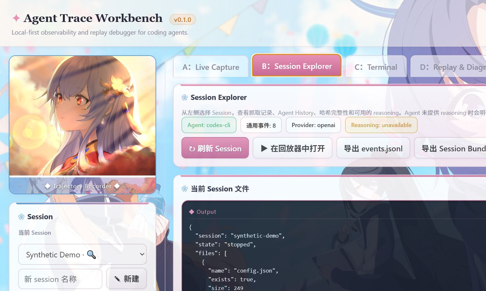

# Agent Trace Workbench

Local-first observability and replay debugger for coding agents.

[](https://github.com/Riordon666/cc-trajectory-workbench/actions/workflows/ci.yml)
[](LICENSE)

Agent Trace Workbench captures API traffic through a local gateway, imports local Agent histories, normalizes both sources into a common event stream, and provides an anime-styled Session explorer, terminal, replay view, and non-blocking diagnostics.



## Privacy defaults

- Listens on `127.0.0.1` only.
- No accounts, cloud storage, analytics, or telemetry.
- Sessions, certificates, logs, custom wallpapers, and private handoff material are Git-ignored.
- Diagnostics never prevent you from viewing, replaying, or exporting your own Session.
- Missing reasoning is shown as `unavailable`; the workbench never invents reasoning or chain-of-thought.

## Supported adapters

| Layer | Adapter | Status |
|---|---|---|
| Agent | Claude Code | Local History discovery/import and Anthropic request classification |
| Agent | Codex CLI | Local rollout discovery/import with version detection |
| Protocol | Anthropic Messages API | Streaming SSE and non-stream JSON |
| Protocol | OpenAI Responses API | Streaming SSE and non-stream JSON |

Codex CLI support is based on the locally observed rollout layout under `%USERPROFILE%\.codex\sessions\YYYY\MM\DD\rollout-*.jsonl`. Only structural evidence was used; real conversations are not included.

## Install and run

Requirements:

- Node.js 20 or newer
- npm

Clone the repository and install its dependencies:

```powershell
git clone https://github.com/Riordon666/cc-trajectory-workbench.git
cd cc-trajectory-workbench
npm install
npm run workbench
```

Open <http://127.0.0.1:5177/>. The UI and terminal assets are local and work without a CDN.

### Gateway mode (default)

Set the relevant upstream origin if you do not use the official default:

```powershell
$env:ANTHROPIC_UPSTREAM_BASE_URL = 'https://api.anthropic.com'
$env:OPENAI_UPSTREAM_BASE_URL = 'https://api.openai.com'
npm run workbench
```

Configure clients with one of these local base URLs:

```text
Anthropic: http://127.0.0.1:5177/gateway/anthropic
OpenAI:    http://127.0.0.1:5177/gateway/openai
```

The gateway exposes only the fixed routes `/v1/messages` and `/v1/responses`; it is not an arbitrary forward proxy. If more than one Session could be recording, clients may send `x-agent-trace-session: <session-id>`.

### Advanced / Legacy MITM

The existing certificate-based MITM remains available for compatibility:

```powershell
npm run setup
npm run proxy
```

Use it only when base URL configuration is not available.

## Workspaces

- **A — Live Capture:** Gateway/Legacy mode, Agent/protocol selection, recording, connection status.
- **B — Session Explorer:** common events, hashes, complete model identifiers, History import, bundle import/export.
- **C — Terminal:** local PTY with Host/Origin, shell, CWD, and concurrency boundaries.
- **D — Replay & Diagnostics:** common-event replay and non-blocking warnings/errors.

The screenshot uses the committed synthetic fixture and contains no real Agent Session.

## Session files

```text
sessions/<id>/
├── config.json
├── events.jsonl
├── gateway-capture.jsonl
├── agent-history.jsonl
├── diagnostics-result.json
└── https-intercepts.json        # Legacy MITM only
```

`events.jsonl` uses the schema documented in [docs/ARCHITECTURE.md](docs/ARCHITECTURE.md). Raw captures remain separate and are never treated as interchangeable with normalized events.

## Session Bundle

A bundle contains:

- `manifest.json`
- `events.jsonl`
- `diagnostics.json`
- `hashes.json`
- redacted raw gateway/legacy capture when present

Certificates and unredacted Agent History are not exported. Diagnostics are informational and never gate export.

## Development

```powershell
node --check forward-proxy.js
node --check workbench/server.js
npm test
git diff --check
```

Tests and examples use synthetic data only. See [CONTRIBUTING.md](CONTRIBUTING.md), [CODE_OF_CONDUCT.md](CODE_OF_CONDUCT.md), [SECURITY.md](SECURITY.md), and [docs/PRIVACY.md](docs/PRIVACY.md).

Release history and planned work are tracked in [CHANGELOG.md](CHANGELOG.md) and [ROADMAP.md](ROADMAP.md). Maintainers should complete [docs/RELEASE_CHECKLIST.md](docs/RELEASE_CHECKLIST.md) before publishing a release.

Report bugs and request features through [GitHub Issues](https://github.com/Riordon666/cc-trajectory-workbench/issues).

## License and artwork

Agent Trace Workbench is licensed under the [MIT License](LICENSE).

The repository owner has confirmed that the 22 bundled anime images may be publicly redistributed with this project. They are not covered by the software's MIT License unless an individual asset explicitly says otherwise. See [THIRD_PARTY_NOTICES.md](THIRD_PARTY_NOTICES.md) and `workbench/public/pic/wallpapers.json`.
