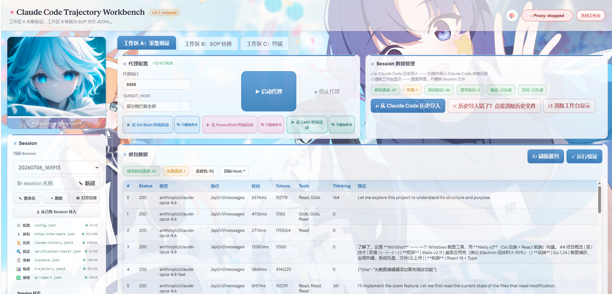
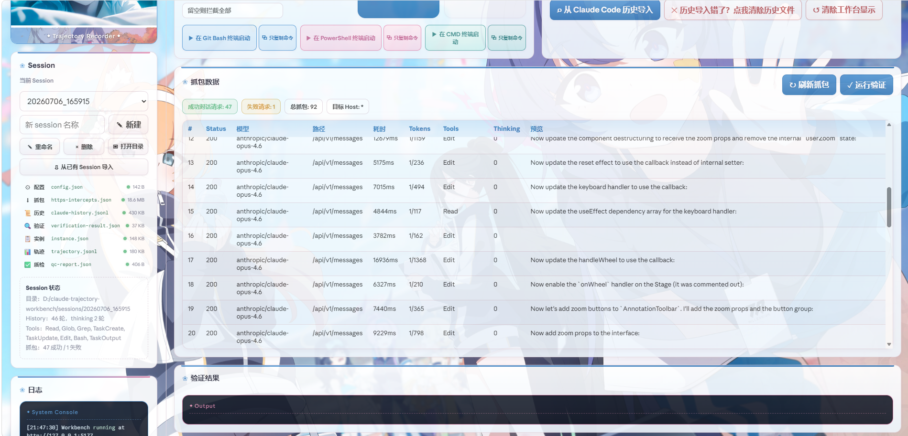
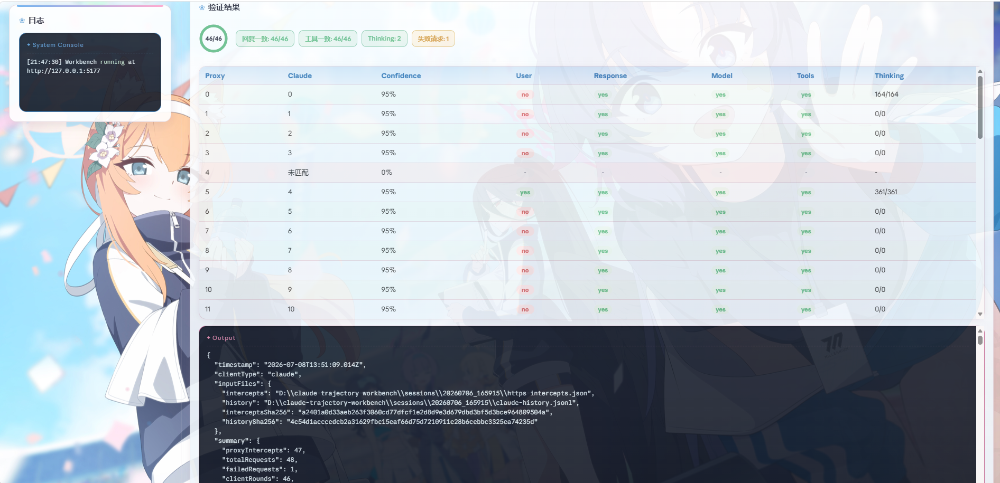
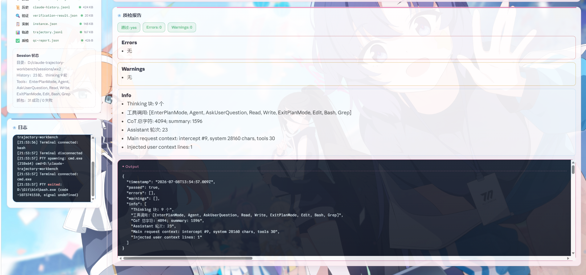

<!-- 可爱的装饰线 -->


<h1 align="center">Claude Code Trajectory Workbench <sup><small>v3.1 release</small></sup></h1>

<p align="center">
  
  
  
</p>

<p align="center">MITM 正向代理 + Web 工作台 + 内置终端，用于采集 Claude Code 编程轨迹数据，验证抓包完整性，并输出抓包与分析文件。</p>


## 环境要求

- **Node.js v18 或更高**（建议 v20+）
- 操作系统：Windows / macOS / Linux 均可
- **npm 依赖**：`ws`（WebSocket）、`node-pty`（伪终端）、`adm-zip`（打包导出），其余使用 Node 内置模块


## 首次使用

```bash
# 1. 安装依赖
npm install

# 2. 生成自签证书（仅首次）
npm run setup

# 3. 启动工作台（默认 5177 端口）
npm run workbench

# 多开工作台时指定其他端口
npm run workbench -- 5180

# 4. 浏览器打开
# http://127.0.0.1:5177
```


## 工作流程

```
新建 Session → 启动代理 → 一键启动 Claude Code（内置终端）→ 编程
→ 停止代理 → 导入数据 → 验证 → SOP 转换 → 质检 → 一键打包下载
```

详细步骤见 `本地工作台作业流程.md`。


## 界面预览

| 工作台全景 | 抓包数据 |
|---|---|
| [](docs/screenshots/overview.png) | [](docs/screenshots/intercepts.png) |

| 内置终端 | 验证结果 | 质检报告 |
|---|---|---|
| [](docs/screenshots/terminal.png) | [](docs/screenshots/verification.png) | [](docs/screenshots/qc-report.png) |


## 文件结构

```
├── forward-proxy.js          # MITM 代理核心（监听 8888）
├── verify.js                 # CLI 验证脚本
├── setup-https-proxy.js      # 证书生成
├── workbench/
│   ├── server.js             # Web 服务端（端口 5177）
│   └── public/
│       ├── index.html        # 前端页面
│       ├── app.js            # 前端逻辑
│       ├── styles.css        # 样式
│       └── pic/              # 壁纸图片
├── sessions/                 # Session 数据目录
│   └── <session_id>/
│       ├── config.json
│       ├── https-intercepts.json
│       ├── claude-history.jsonl
│       ├── verification-result.json
│       ├── instance.json
│       ├── trajectory.jsonl
│       └── qc-report.json
├── certs/                    # 自签证书
│   ├── cert.pem
│   └── key.pem
└── package.json
```


## 命令说明

| 命令 | 说明 |
|---|---|
| `npm run setup` | 生成自签证书 |
| `npm run workbench` | 启动 Web 工作台（默认 5177，`-- 端口号` 指定端口） |
| `npm run proxy` | 单独启动代理（CLI 模式） |
| `npm run verify` | CLI 验证脚本 |


## 注意事项

- **不要**用别人给的证书，务必自己 `npm run setup` 生成
- 代理环境变量只在执行命令的终端内生效，开新终端即失效
- 代理未启动时，直接 `claude` 命令不受影响，可正常使用


## 贡献者

<a href="https://github.com/Riordon666/claude-trajectory-workbench/graphs/contributors">
  
</a>


## Star History

[](https://star-history.com/#Riordon666/claude-trajectory-workbench&Date)
